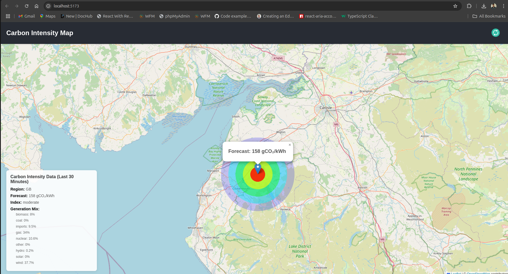

# Carbon Intensity Map

A web application that visualizes carbon intensity data across regions using an interactive map. The app displays carbon intensity forecasts and actual values for different regions, with a heatmap and interactive markers.

# Features

- Interactive Map: Displays carbon intensity data on a map using heatmaps and markers.

- Heatmap: Visualizes carbon intensity with a gradient color scheme (blue → cyan → lime → yellow → red).

- Region Selection: Click on a marker to view detailed carbon intensity data for a specific region.

- Dynamic Radius: The heatmap radius adjusts based on the intensity values and zoom level.

- Responsive Design: Works seamlessly on different screen sizes.

# Technologies Used

- React: A JavaScript library for building user interfaces.

- TypeScript: Adds static typing to JavaScript for better code quality.

- Leaflet: An open-source JavaScript library for interactive maps.

- React-Leaflet: React components for Leaflet maps.

- TanStack Query (React Query): For data fetching and caching.

- Axios: For making HTTP requests to the API.

- CSS: For styling the application.

# Setup Instructions
# Prerequisites
- Node.js: Ensure you have Node.js installed on your machine. You can download it from here.

- npm: npm is bundled with Node.js.

# Installation
# Clone the repository:

```
git clone https://github.com/your-username/carbon-intensity-map.git
cd carbon-intensity-map
```

# Install dependencies:
```
npm install
```

# Run the development server:
```
npm start
```
# Open the app:

Visit http://localhost:5173 in your browser.

# Environment Variables
- If you need to use environment variables (e.g., for API keys), create a .env file in the root directory and add the following:

```
REACT_APP_API_URL=https://api.carbonintensity.org.uk
```

# Available Scripts
npm run dev: Runs the app in development mode.

npm run build: Builds the app for production.

# Project Structure
```
carbon-intensity-map/
├── public/                  # Static assets
├── src/
│   ├── assets/              # Images, styles, etc.
│   ├── components/          # Reusable components
│   │   ├── DataDisplay/     # Data display component
│   │   ├── MapComponent/    # Map component
│   │   └── Loader/          # Loading spinner component
│   ├── context/             # React Context API
│   ├── hooks/               # Custom hooks
│   ├── types/               # TypeScript type definitions
│   ├── App.tsx              # Main application component
│   ├── index.tsx            # Entry point
│   └── react-app-env.d.ts   # TypeScript declarations
├── .env                     # Environment variables
├── package.json             # Project dependencies
├── README.md                # Project documentation
└── tsconfig.json            # TypeScript configuration
```
# API Used
The app uses the Carbon Intensity API to fetch carbon intensity data for different regions. The API endpoint used is:

https://api.carbonintensity.org.uk/regional
For more details, visit the API documentation.

Screenshots
Carbon Intensity Map Screenshot



License
This project is licensed under the MIT License. See the LICENSE file for details.